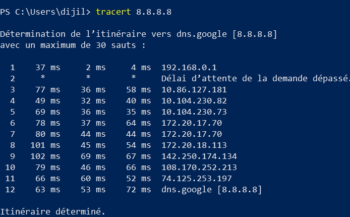

# Phase 1 – Basic Network Connectivity

## Objective

Test basic network connectivity from Windows and identify the network path to an external DNS server.

## 1. Ping 8.8.8.8

A ping test was performed to check connectivity to Google's public DNS server.

## 2. Ping 192.168.0.1

A ping test was performed to check connectivity to the local network gateway.

## 3. Ping google.com

A ping test was performed using a domain name to verify connectivity and DNS resolution.

## 4. Tracert 8.8.8.8

The `tracert` command was used to examine the network path toward Google's public DNS server.

The first hop was the local gateway (`192.168.0.1`). Some intermediate hops did not respond to the traceroute request, while later hops responded.

## 5. Curl

A `curl` connectivity test was performed and the output was recorded.

## Status

**Applied**
