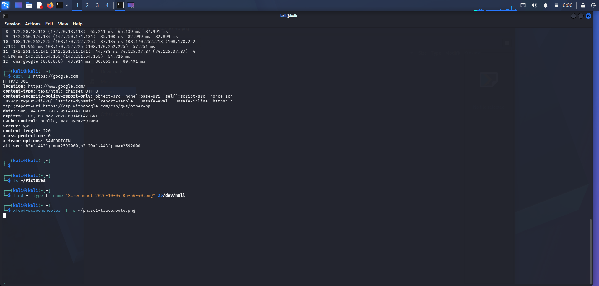

# Phase 1 – Basic Network Connectivity

## Objective

Test basic network connectivity and identify the network path to an external DNS server from Windows and Kali Linux.

## Windows

### 1. Ping 8.8.8.8

A ping test was performed to check connectivity to Google's public DNS server.

### 2. Ping 192.168.0.1

A ping test was performed to check connectivity to the local network gateway.

### 3. Ping google.com

A ping test was performed using a domain name to verify connectivity and DNS resolution.

### 4. Tracert 8.8.8.8

The `tracert` command was used to examine the network path toward Google's public DNS server.

The first hop was the local gateway (`192.168.0.1`). Some intermediate hops did not respond to the traceroute request, while later hops responded.

### 5. Curl

A `curl` connectivity test was performed and the output was recorded.

## Kali Linux

### 1. IP Configuration

The `ip addr` command was used to inspect the network interfaces.

The active `eth0` interface had:

- IPv4 address: `192.168.0.142/24`
- Interface state: `UP`

### 2. Ping 8.8.8.8

A ping test was performed against Google's public DNS server.

- Packets transmitted: `4`
- Packets received: `4`
- Packet loss: `0%`
- Average RTT: `77.545 ms`

### 3. Ping 192.168.0.1

A ping test was performed against the local network gateway.

- Packets transmitted: `4`
- Packets received: `4`
- Packet loss: `0%`
- Average RTT: `6.214 ms`

### 4. Ping google.com

A domain ping test was performed to verify connectivity and DNS resolution.

- Resolved address: `142.251.142.142`
- Packets received: `4/4`
- Packet loss: `0%`
- Average RTT: `65.914 ms`

### 5. Traceroute 8.8.8.8

The `traceroute` command was used to examine the network path toward Google's public DNS server.

The first hop was the local gateway (`192.168.0.1`). One intermediate hop did not respond, while the route continued through additional hops and reached `dns.google (8.8.8.8)`.

### 6. Curl

A request to `https://google.com` returned an `HTTP/2 301` response redirecting to `https://www.google.com/`.

## Status

**Applied**
