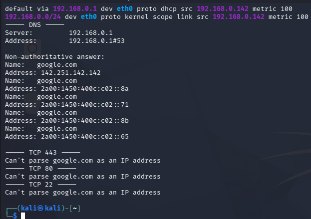

# Phase 2 – IP Configuration, Routing and DNS Resolution

## Objective

Inspect IP configuration, routing information, DNS resolution, and basic connectivity on Windows and Kali Linux.

## Windows

### IP Configuration

The active Wi-Fi adapter was configured with:

- IPv4: `192.168.0.127`
- Subnet mask: `255.255.255.0`
- Default gateway: `192.168.0.1`
- DHCP server: `192.168.0.1`
- DNS server: `192.168.0.1`

A VirtualBox Host-Only network `192.168.56.0/24` was also present.

### Routing Table

The default IPv4 route used gateway `192.168.0.1`.

### DNS Resolution

`nslookup google.com` successfully resolved the domain.

DNS server: `192.168.0.1`

Resolved IPv4 address included:

`142.251.142.142`

### Connectivity Test

`Test-NetConnection google.com` returned:

- Interface: `Wi-Fi`
- Source address: `192.168.0.127`
- Ping: `True`
- RTT: `54 ms`

## Kali Linux

### IP Configuration and Routing

The active `eth0` interface had:

- IPv4: `192.168.0.142/24`
- State: `UP`
- Default gateway: `192.168.0.1`

### DNS Resolution

`nslookup google.com` successfully resolved the domain.

DNS server: `192.168.0.1`

IPv4 address:

`142.251.142.142`

### TCP Connectivity

TCP connectivity was tested with `nc`:

- Port `443`: **Open**
- Port `80`: **Open**
- Port `22`: **Connection timed out**

The port 22 result is documented as a timeout, not as proof that the port is closed.

## Status

**Applied**
