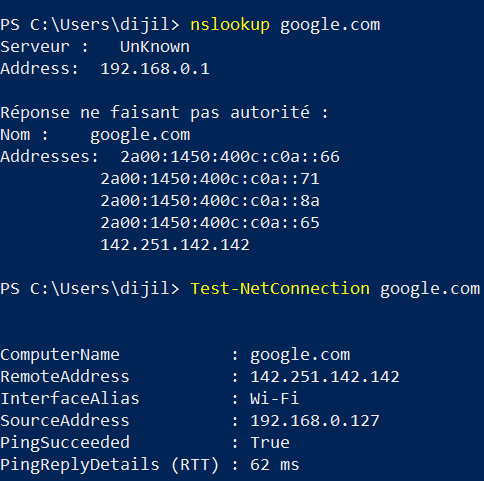

# Phase 2 – IP Configuration and DNS Resolution

## Objective

Inspect the Windows network configuration, routing information, DNS resolution, and basic connectivity.

## 1. IP Configuration

The Windows network configuration was inspected using `ipconfig /all`.

The active Wi-Fi adapter was configured with:

- IPv4 address: `192.168.0.127`
- Subnet mask: `255.255.255.0`
- Default gateway: `192.168.0.1`
- DHCP server: `192.168.0.1`
- DNS server: `192.168.0.1`

A VirtualBox Host-Only adapter was also present with the network `192.168.56.0/24`.

## 2. Routing Table

The routing table was inspected using `route print`.

The default IPv4 route uses:

- Gateway: `192.168.0.1`
- Interface: `192.168.0.127`

A separate local route was also present for the VirtualBox Host-Only network `192.168.56.0/24`.

## 3. DNS Resolution

The `nslookup google.com` command successfully resolved the domain.

DNS server:

`192.168.0.1`

Resolved addresses included:

- IPv4: `142.251.142.142`
- IPv6: `2a00:1450:4003:805::200e`

## 4. Connectivity Test

`Test-NetConnection google.com` confirmed successful connectivity.

- Interface: `Wi-Fi`
- Source address: `192.168.0.127`
- Remote address: `142.251.142.142`
- Ping: `True`
- RTT: `54 ms`

## Status

**Applied**
