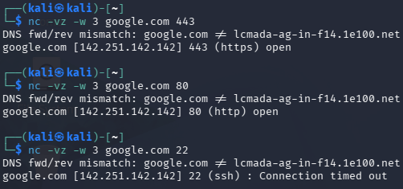

# Phase 3 – TCP Port Connectivity Testing

## Objective

Test TCP connectivity to different ports on an external host and compare the results on Windows and Kali Linux.

## Windows

### Port 443 – HTTPS

`Test-NetConnection google.com -Port 443`

- Remote port: `443`
- Interface: `Wi-Fi`
- Source address: `192.168.0.127`
- TCP test: `True`

### Port 80 – HTTP

`Test-NetConnection google.com -Port 80`

- Remote port: `80`
- Interface: `Wi-Fi`
- Source address: `192.168.0.127`
- TCP test: `True`

### Port 22 – SSH

`Test-NetConnection google.com -Port 22`

- Remote port: `22`
- Interface: `Wi-Fi`
- Source address: `192.168.0.127`
- TCP test: `False`

The TCP connection to port 22 failed during the test.

## Kali Linux

### Port 443 – HTTPS

`nc -vz -w 3 google.com 443`

Result:

`443 (https) open`

### Port 80 – HTTP

`nc -vz -w 3 google.com 80`

Result:

`80 (http) open`

### Port 22 – SSH

`nc -vz -w 3 google.com 22`

Result:

`22 (ssh) Connection timed out`

The port 22 result is documented as a timeout, not as proof that the port is closed.

## Status

**Applied**
