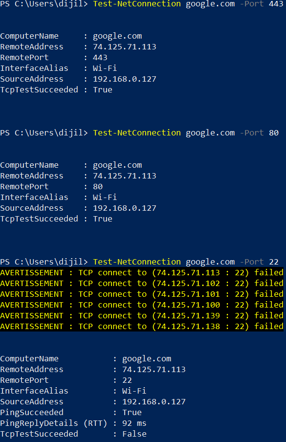

# Phase 3 – TCP Port Connectivity Testing

## Objective

Test TCP connectivity to different ports on an external host and compare the results.

## 1. HTTPS – Port 443

A TCP connectivity test was performed against `google.com` on port `443`.

The connection succeeded:

- Remote port: `443`
- Interface: `Wi-Fi`
- Source address: `192.168.0.127`
- TCP test: `True`

## 2. HTTP – Port 80

A TCP connectivity test was performed against `google.com` on port `80`.

The connection succeeded:

- Remote port: `80`
- Interface: `Wi-Fi`
- Source address: `192.168.0.127`
- TCP test: `True`

## 3. SSH – Port 22

A TCP connectivity test was performed against `google.com` on port `22`.

The TCP connection failed:

- Remote port: `22`
- Interface: `Wi-Fi`
- Source address: `192.168.0.127`
- Ping: `True`
- TCP test: `False`

The test confirmed that ICMP connectivity to the resolved host was possible while the TCP connection attempt to port 22 failed.

## Status

**Applied**
