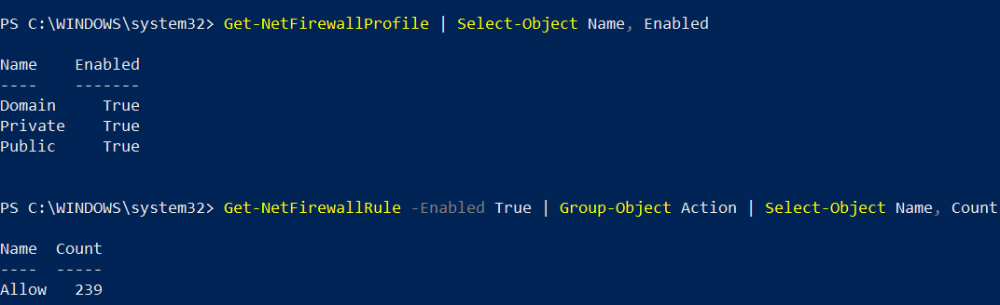
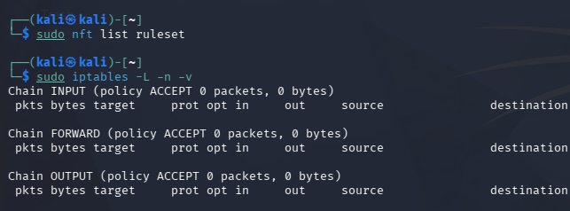

# Phase 4 – Firewall Inspection

## Objective

Inspect firewall configuration and enabled filtering rules on Windows and Kali Linux.

## Windows

### Firewall Profiles

The Windows Firewall profiles were inspected using `Get-NetFirewallProfile`.

All three profiles were enabled:

- Domain: `True`
- Private: `True`
- Public: `True`

### Enabled Firewall Rules

A total of `239` enabled Windows Firewall rules were found.

### Firewall Rule Actions

The enabled rules were grouped by action.

The result showed:

- Allow: `239`

No enabled `Block` rules were returned by the tested query.

## Kali Linux

### UFW

The `ufw` command was not available on the system.

### nftables

`sudo nft list ruleset` returned no rules.

### iptables

The current iptables configuration was inspected using:

`sudo iptables -L -n -v`

The three main chains had the following policies:

- INPUT: `ACCEPT`
- FORWARD: `ACCEPT`
- OUTPUT: `ACCEPT`

No additional iptables rules were listed in the captured output.

These results describe the current filtering configuration observed during the test; they do not by themselves prove that the system has no firewall functionality.

## Status

**Applied**
