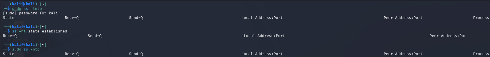

# Phase 5 – TCP Connection Monitoring

## Objective

Inspect TCP listening ports and active TCP connections on Windows and Kali Linux.

## Windows

### Listening TCP Ports

The Windows TCP listening ports were inspected using:

`Get-NetTCPConnection -State Listen`

Several listening ports were identified, including:

- `135`
- `445`
- `5357`
- Dynamic ports in the `49664–49669` range

### Established TCP Connections

Active TCP connections were inspected using:

`Get-NetTCPConnection -State Established`

Five established connections were reviewed.

The observed remote ports included:

- `443` (HTTPS)
- `80` (HTTP)

The captured connections were associated with the `SearchApp` process.

## Kali Linux

### Listening TCP Ports

The command:

`sudo ss -lntp`

returned no TCP sockets in the `LISTEN` state at the time of the test.

### Established TCP Connections

The command:

`ss -nt state established`

returned no TCP connections in the `ESTABLISHED` state at the time of the test.

### TCP Socket Check

The command:

`sudo ss -ntp`

also returned no TCP sockets in the captured output.

These results describe the TCP socket state observed at the time of testing.

## Status

**Applied**
