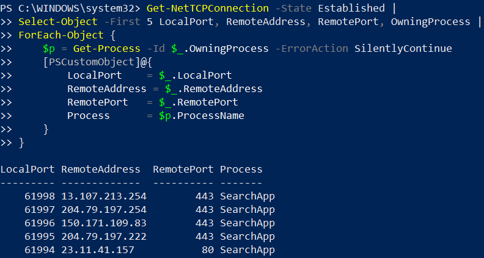

# Phase 5 – TCP Connection Monitoring

## Objective

Inspect active TCP listeners and established connections on Windows.

## 1. Listening TCP Ports

The Windows TCP listening ports were inspected using `Get-NetTCPConnection -State Listen`.

Several listening ports were identified, including:

- `135`
- `445`
- `5357`
- Dynamic ports in the `49664–49669` range

## 2. Established TCP Connections

Active TCP connections were inspected using `Get-NetTCPConnection -State Established`.

Five established connections were reviewed.

The observed remote ports included:

- `443` (HTTPS)
- `80` (HTTP)

The connections were associated with the `SearchApp` process in the captured output.

## 3. Process Identification

The owning process of TCP connections can be identified using the `OwningProcess` PID and `Get-Process`.

## Status

**Applied**
